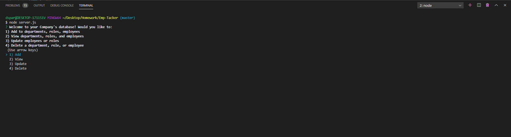
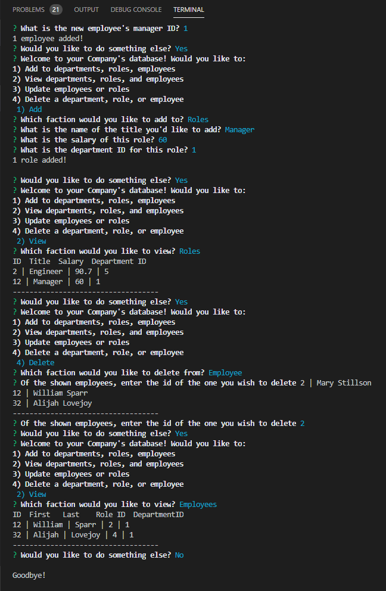

# Emp-Tacker
A command-line application that allows the user to:

  * Add departments, roles, employees

  * View departments, roles, employees

  * Update employee roles and employees

  * Delete departments, roles, and employees

## Description
The application is a solution for managing a company's employees. The app utilizes **C**ontent **M**anagement **S**ystem interface, allowing for non-developers to easily interact with information stored in the database. 

## User Story & Business Context
```
As a business owner
I want to be able to view and manage the departments, roles, and employees in my company
So that I can organize and plan my business
```

## Technologies
* MySQL Database
* NodeJS
    * inquirer
    * mysql
    * dotenv

## Installation
```bash
npm install
```

## Screenshot



